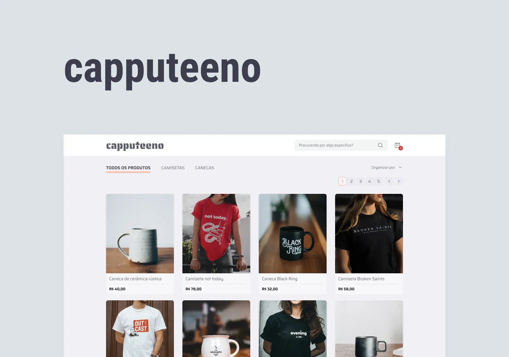

# Capputeeno - E-commerce :coffee:

 

 <a href="#project">👉 Project</a>
 <a href="#technologies">👉 Technologies</a>
 <a href="#execution">👉 Execution</a>
 <a href="#author">👉 Author</a>

 
<h2 id="project">Project</h2>
 
 

this project is a resolution of [this rocketseat challenge](https://github.com/Rocketseat/frontend-challenge).

Welcome to our front-end e-commerce project! This project is designed to provide users with an easy-to-use and visually appealing online shopping experience. With a responsive design that adapts to any screen size, customers can browse and purchase products on desktop, tablet, or mobile devices.

this e-commerce has the following features: 

<ul>
<li>Catalog of products with pagination</li>
<li>Filtering products by category</li>
<li>Search by product name</li>
<li>Add and remove products from cart</li>
<li>Checkout</li>
</ul>

 

 

<h2>Prototype</h2>

The Prototype of this project can be found in this [link from figma](https://www.figma.com/file/rET9F2CeUEJdiVN7JRu993/E-commerce---capputeeno?node-id=680%3A6449&t=YPqCmUf0KiCxadUP-1).

 

<h2 id="technologies">Used Technologies</h2>

This project was developed with the following technologies:

- <a target="_blank" href="https://nodejs.org/en/">Node 16.13</a>
- <a target="_blank" href="https://reactjs.org/">React 18.0</a>
- <a target="_blank" href="https://nextjs.org/">NextJs 12.2</a>
- <a target="_blank" href="https://graphql.org/">GraphQL</a>
- <a target="_blank" href="https://styled-components.com/">Styled Components</a>
- <a target="_blank" href="https://www.typescriptlang.org/">TypeScript 4.5.4</a>
- <a target="_blank" href="https://www.radix-ui.com/">Radix-UI</a>
- <a target="_blank" href="https://eslint.org/">ESLint</a>

 

<h2 id="execution">Execution</h2>

To run the project:

- First we have to:
  - Clone the project by running this command in the terminal `git clone <repo_url>`;
       
       
- Open the project folder `api` in the terminal and run:
  - `yarn` or `npm install` -> To install all dependencies;
  - `yarn start` or `npm run start` -> To run the api's mocks;
 
 
- Open the project root folder in the terminal and run:
  - `yarn` or `npm install` -> To install all dependencies;
  - `yarn dev` or `npm run dev` -> To run the project;

  

<h2 id="author">👨🏻‍💻 Author</h2>

 

<h4>Luiz Fellipe<h4> 

 

